<div align="center">

# AllAbout 📝

**A production-grade, multi-vendor blogging platform for creators.**

Publish Articles, Audio, and Video with built-in SEO, monetization-ready architecture, an admin CMS, and a modern JWT + Google OAuth authentication system.

[](https://nextjs.org/)
[](https://nodejs.org/)
[](https://www.mongodb.com/)
[](https://www.typescriptlang.org/)
[](https://opensource.org/licenses/MIT)

</div>

---

## 🌟 What is AllAbout?

**AllAbout** is a full-stack, self-hosted publishing platform designed for independent creators, writers, and journalists. It combines the simplicity of Medium with the power of a self-hosted CMS — giving creators complete ownership over their content, audience, and brand.

The platform supports three content types (**Articles**, **Audio**, **Video**), a robust follow system, organic tag aggregation, nested comments with likes and notifications, an admin CMS, newsletter subscriptions, and a lean Yoast-style SEO panel for authors.

---

## 📸 Screenshots

### 🏠 Homepage
> Dynamic hero with live search, trending authors, multi-format content sections, and newsletter CTA.

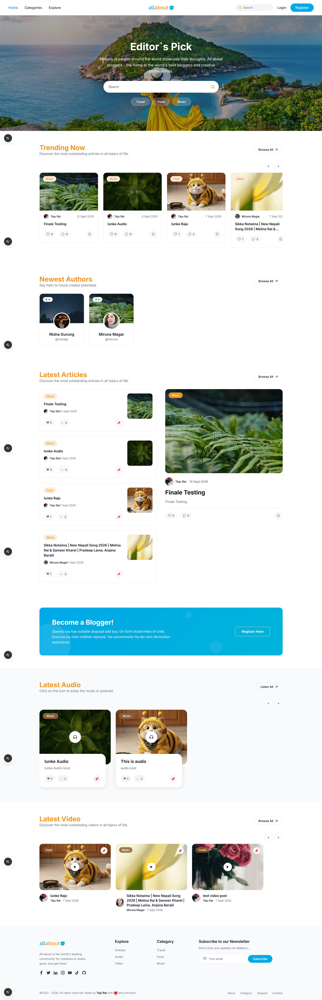

### 🔍 Explore Landing
> Discover content by type — Articles, Audio, and Video — with custom titles, icons, and descriptions managed from the admin panel.

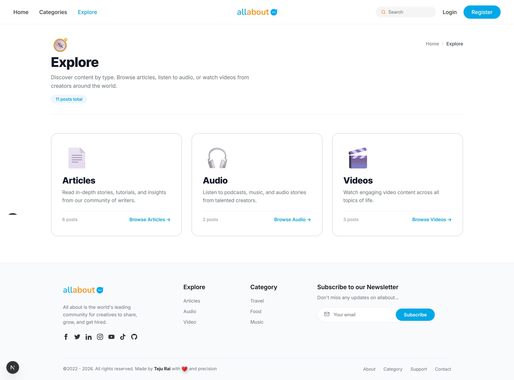

### 📝 Single Post Page
> Full reading experience with featured image, rich content, author info, comments, likes, and social sharing.

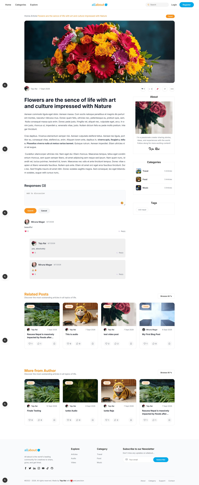

### 👤 Author Profile
> Public creator profile with bio, follower count, follow button, and their published catalog.

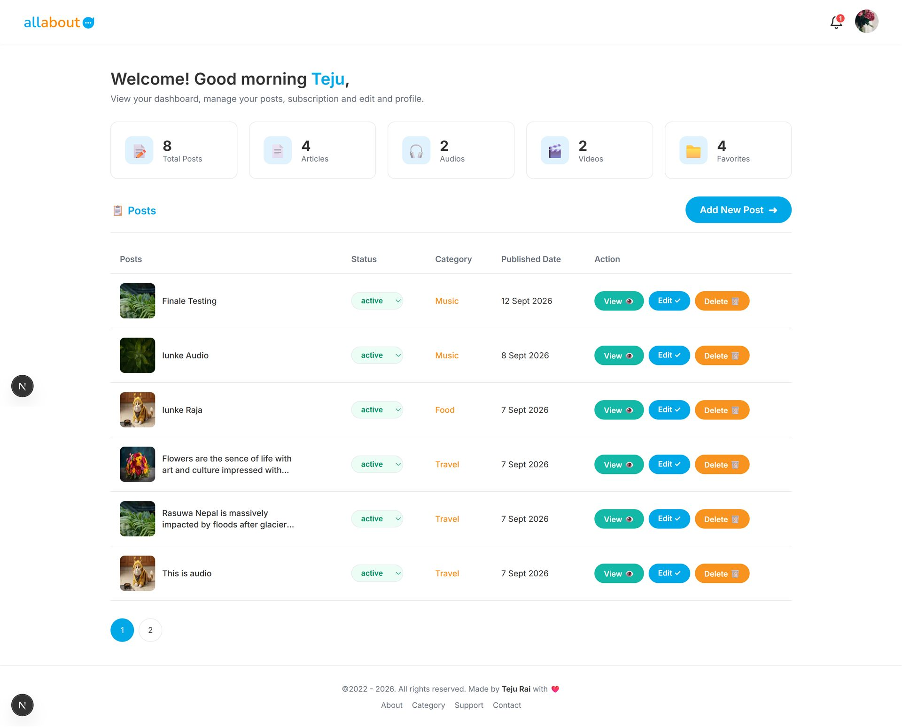

### 📚 Categories
> Browse all categories with dynamic imagery and post counts.

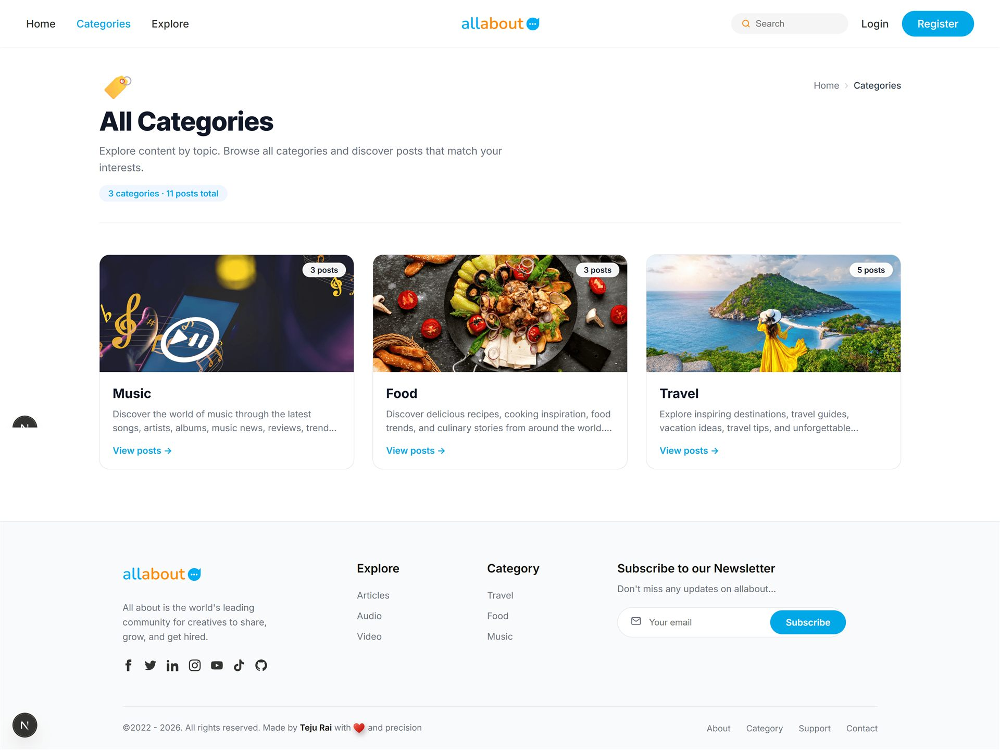

### 📂 Single Category
> Category-specific view with paginated posts and SEO-optimized metadata.

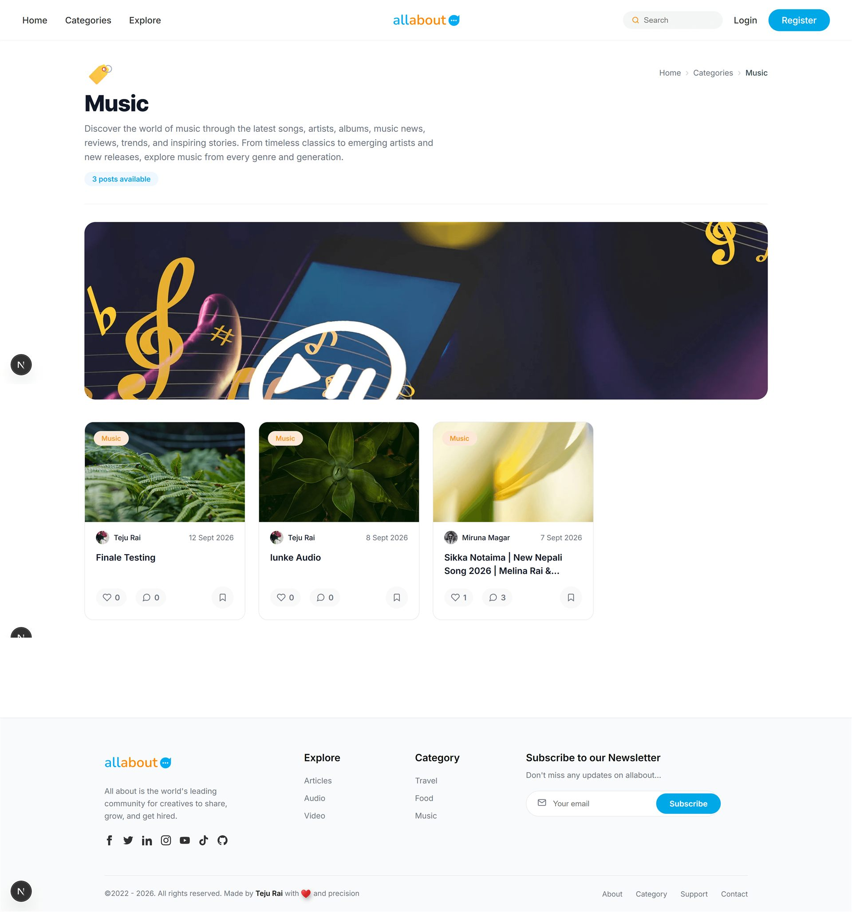

### 🔐 Google Login
> Dual-path authentication — email/password or one-click Google OAuth, both converging on the same JWT flow.

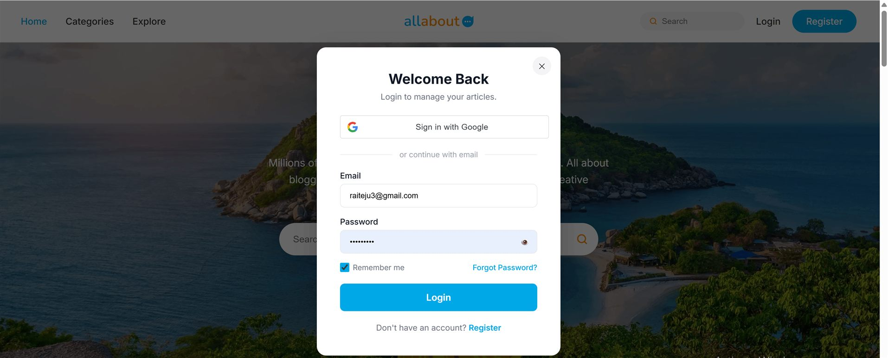

### ✍️ Add New Post
> Rich text editor (Quill) with Cloudinary uploads, live image preview, and a lean Yoast-style SEO panel.

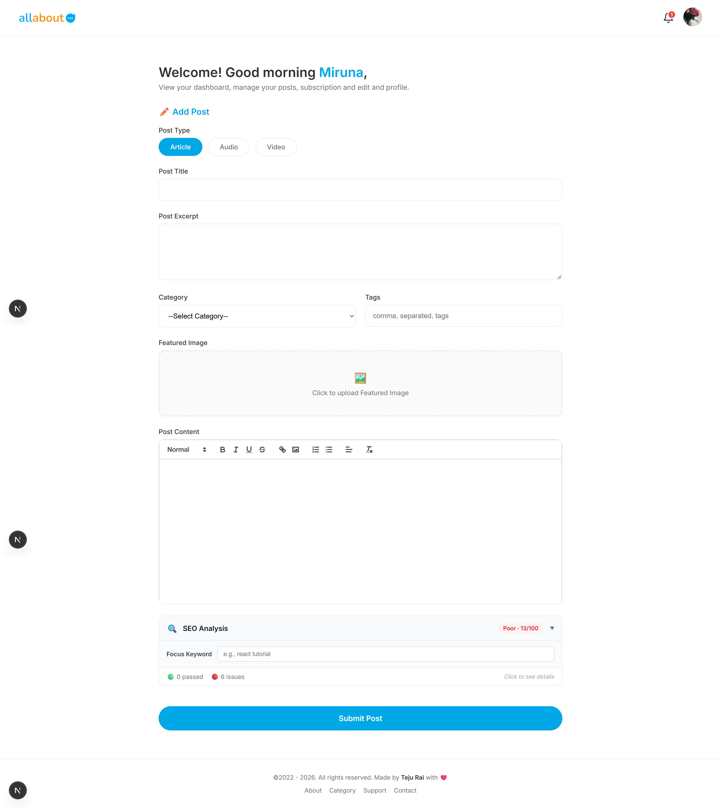

### 🖊️ Edit Post
> Same powerful editor in edit mode, with SEO analysis and image management.

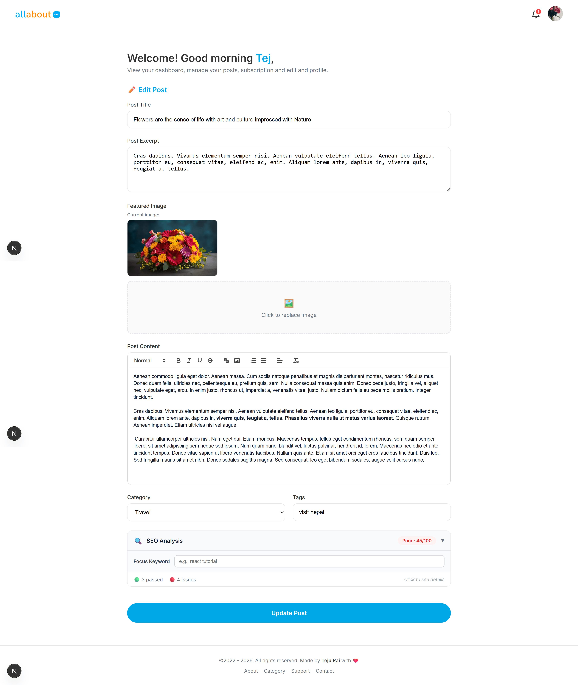

### ⚙️ Admin Panel
> Full CMS with user management, content moderation, newsletter subscribers, contact submissions, and site-wide settings.

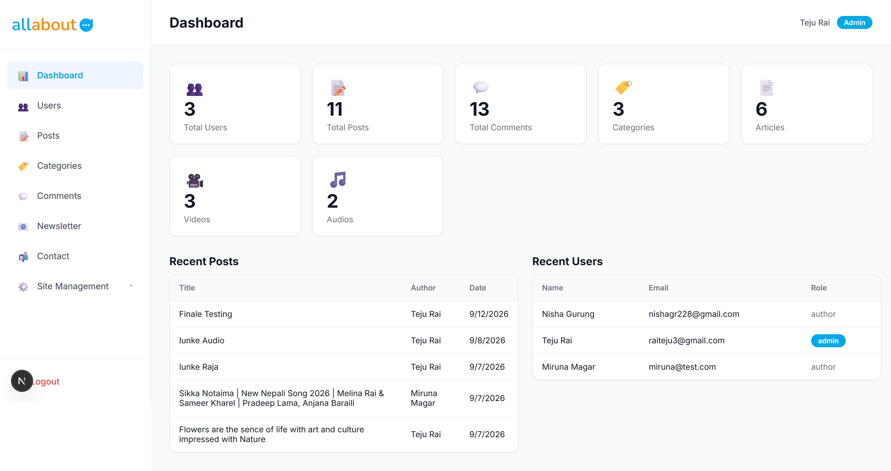

### 🎛️ Homepage & SEO Management
> Six-tab admin panel for managing homepage sections, explore page settings, and site-wide SEO defaults.

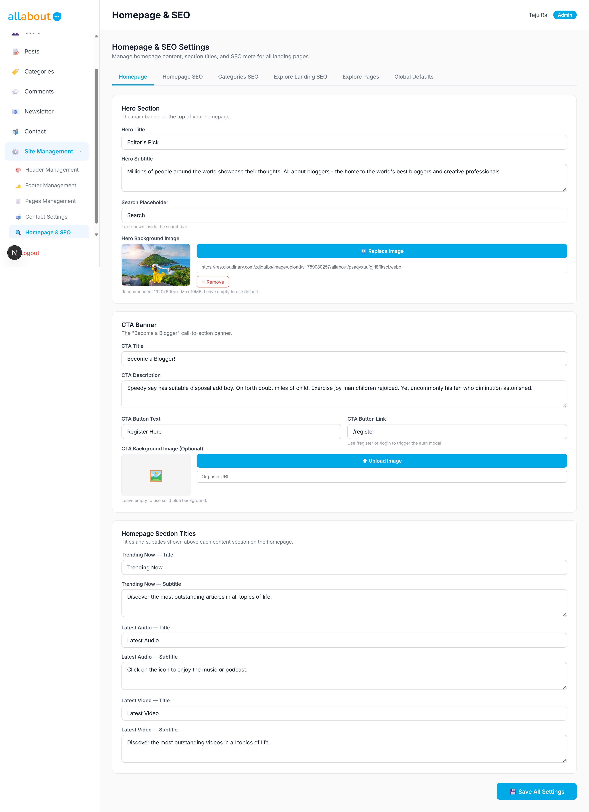

---

## ✨ Key Features

### 📝 For Creators
- **Multi-format publishing** — Articles, Audio, and Video in one platform
- **Rich text editor** — Built with `react-quill-new`, sanitized for XSS protection
- **Cloudinary media hosting** — 10MB image uploads with live previews
- **Lean SEO panel** — Yoast-inspired (~15 checks) for on-page optimization
- **Follow system** — Build an audience with follower notifications
- **Draft & publish workflow** — Control when your content goes live
- **Public author profile** — Customizable bio, avatar, cover, and social links

### 🎨 For Readers
- **Smart discovery** — Explore by Articles, Audio, or Video
- **Live search** — Instant suggestions in the homepage hero
- **Category & tag pages** — Dynamic content aggregation
- **Author pages** — Follow creators and browse their catalog
- **Newsletter subscription** — Stay updated with one click

### 🛡️ For Admins
- **Full CMS** — Manage pages, header, footer, and site-wide settings
- **User management** — Roles, CSV exports, and moderation tools
- **Content moderation** — Comments, posts, and category management
- **Contact submissions** — Workflow with status tracking and notes
- **Newsletter management** — Subscriber list + CSV export
- **Explore page manager** — Custom titles, icons, and visibility per content type
- **Homepage & SEO** — 6-tab settings panel for site-wide SEO controls

### 🔒 Security & Performance
- **Helmet** — 15+ security headers enabled
- **CORS whitelist** — Locked to known origins
- **Rate limiting** — 6 custom limiters on auth, contact, and newsletter routes
- **XSS sanitization** — `sanitize-html` on all rich content
- **JWT authentication** — 30-day expiry with bcryptjs hashing
- **Google OAuth** — Direct OAuth2 flow (no session conflicts)
- **Password reset** — SHA-256 hashed tokens with 1-hour TTL
- **Compression** — Gzip middleware enabled
- **MongoDB indexes** — 11 strategic indexes for fast queries
- **API caching** — Next.js `revalidate` on public reads
- **Image optimization** — Next.js `<Image>` with proper `sizes` props
- **Self-hosted fonts** — `next/font/google` for zero layout shift

### 🔍 SEO & Discovery
- **Dynamic `sitemap.xml`** — Auto-generated from posts, categories, authors, pages, and tags
- **Dynamic `robots.txt`** — Blocks admin, dashboard, and API routes
- **Server-rendered meta tags** — Per-page `generateMetadata()` on all public routes
- **OpenGraph & Twitter cards** — Rich previews on social platforms
- **Structured URLs** — Flat `/post/[slug]` architecture

---

## 🛠️ Tech Stack

### Frontend
| Technology | Purpose |
|-----------|---------|
| **Next.js 16** (App Router) | React framework with SSR & ISR |
| **TypeScript** | Type safety for `.tsx` files |
| **Vanilla CSS Modules** | Scoped styling, zero framework dependency |
| **react-quill-new** | Rich text editing for posts |
| **@react-oauth/google** | Google login button & token retrieval |
| **next/font** | Self-hosted Inter font |

### Backend
| Technology | Purpose |
|-----------|---------|
| **Node.js + Express** | REST API (CommonJS) |
| **MongoDB + Mongoose v8** | Database with strategic indexes |
| **JWT + bcryptjs** | Stateless authentication |
| **google-auth-library** | Google ID token verification |
| **Cloudinary** | Media hosting (images, audio, video) |
| **Multer** | File upload middleware |
| **Nodemailer** | Transactional emails (Gmail SMTP) |
| **Helmet** | Security headers |
| **express-rate-limit** | Rate limiting |
| **sanitize-html** | XSS protection |
| **compression** | Gzip response compression |

### Infrastructure
| Service | Purpose |
|---------|---------|
| **Vercel** | Frontend hosting |
| **Render** | Backend hosting |
| **MongoDB Atlas** | Cloud database |
| **Cloudinary CDN** | Global media delivery |
| **Gmail SMTP** | Email delivery |

---

## 🏗️ Architecture Overview

```
┌─────────────────────┐         ┌──────────────────────┐
│                     │         │                      │
│   Next.js Frontend  │────────▶│  Express REST API    │
│   (Vercel + CDN)    │  HTTPS  │  (Render)            │
│                     │         │                      │
└─────────┬───────────┘         └──────────┬───────────┘
          │                                │
          │                                │
          │                   ┌────────────┼────────────┐
          │                   │            │            │
          ▼                   ▼            ▼            ▼
    ┌──────────┐       ┌──────────┐  ┌─────────┐  ┌──────────┐
    │ Google   │       │ MongoDB  │  │Cloudinary│  │ Gmail    │
    │ OAuth    │       │  Atlas   │  │   CDN   │  │  SMTP    │
    └──────────┘       └──────────┘  └─────────┘  └──────────┘
```

### Auth Flow (Dual-Path)
All authentication paths converge on the same JWT:
- **Email/Password** → `POST /api/auth/login` → JWT
- **Google OAuth** → Popup → `id_token` → `POST /api/auth/google-login` → Same JWT

Result: Zero refactoring, existing users unaffected, and both paths work seamlessly.

---

## 📂 Project Structure

```
all-about/
├── backend/                    # Node.js + Express API
│   ├── server.js               # Entry point
│   ├── .env                    # Secrets (gitignored)
│   └── src/
│       ├── config/             # DB, Cloudinary, Multer
│       ├── controllers/        # 13 controllers
│       ├── middleware/         # Auth + rate limiters
│       ├── models/             # 11 Mongoose schemas
│       ├── routes/             # 10 route files
│       └── utils/              # Email, sanitization, SEO
│
└── frontend/                   # Next.js 16 App Router
    ├── app/                    # Pages (public, admin, dashboard)
    ├── components/             # Reusable UI components
    ├── lib/                    # API client + SEO analyzer
    └── public/                 # Static assets
```

---

## 🚀 Getting Started

### Prerequisites
- Node.js 20+
- MongoDB Atlas account
- Cloudinary account
- Gmail account (with App Password for SMTP)
- Google Cloud Console project (for OAuth)

### 1. Clone the repository
```bash
git clone https://github.com/raiteju/all-about.git
cd all-about
```

### 2. Setup the backend
```bash
cd backend
npm install
```

Create `backend/.env`:
```env
PORT=5000
MONGODB_URI=mongodb+srv://...
JWT_SECRET=your_jwt_secret
CLOUDINARY_CLOUD_NAME=your_cloud_name
CLOUDINARY_API_KEY=your_api_key
CLOUDINARY_API_SECRET=your_api_secret
SMTP_HOST=smtp.gmail.com
SMTP_PORT=587
SMTP_USER=your_email@gmail.com
SMTP_PASS=your_gmail_app_password
FRONTEND_URL=http://localhost:3000
GOOGLE_CLIENT_ID=your_google_client_id.apps.googleusercontent.com
GOOGLE_CLIENT_SECRET=your_google_client_secret
```

Start the backend:
```bash
node server.js
```

### 3. Setup the frontend
```bash
cd ../frontend
npm install
```

Create `frontend/.env.local`:
```env
NEXT_PUBLIC_SITE_URL=http://localhost:3000
NEXT_PUBLIC_GOOGLE_CLIENT_ID=your_google_client_id.apps.googleusercontent.com
NEXT_PUBLIC_API_URL=http://localhost:5000
```

Start the frontend:
```bash
npm run dev
```

Visit `http://localhost:3000` 🎉

---

## 🔐 Security Highlights

This project follows modern security best practices:

| Concern | Mitigation |
|---------|-----------|
| XSS attacks | `sanitize-html` on all rich content |
| Brute force | Rate limiters on auth endpoints |
| CSRF | Stateless JWT (no cookies) |
| SQL/NoSQL injection | Mongoose schema validation |
| Sensitive data exposure | All secrets in `.env`, gitignored |
| DDoS | Global rate limiter + Vercel/Render protection |
| Password breaches | bcryptjs (10 rounds) + reset tokens with TTL |
| Token theft | 30-day JWT expiry + HTTPS-only in production |
| OAuth impersonation | Google ID token verified server-side |

---

## 📊 Performance Highlights

- **Lighthouse-ready** — SSR + image optimization + self-hosted fonts
- **Database efficiency** — 11 strategic indexes on hot query paths
- **API caching** — 30–300s `revalidate` windows on public reads
- **Global CDN** — Cloudinary media delivery from edge locations
- **Gzip compression** — All responses compressed at the middleware level
- **Font optimization** — `next/font` eliminates layout shift and external requests

---

## 🗺️ Roadmap

- [x] Multi-format publishing (Articles, Audio, Video)
- [x] JWT authentication + Google OAuth
- [x] Admin CMS with tabbed settings
- [x] SEO system (sitemap, robots, meta)
- [x] Newsletter & contact submissions
- [x] Security hardening (Helmet, rate limits, sanitization)
- [x] Performance optimization (indexes, caching)
- [ ] Paid subscriptions (Stripe integration)
- [ ] Real-time notifications (WebSockets)
- [ ] Multi-language support (i18n)
- [ ] Mobile app (React Native)

---

## 📄 License

This project is licensed under the **MIT License** — see the [LICENSE](./LICENSE) file for details.

---

## 👤 Author

**Teju Rai**
- 🌐 Website: [tejurai.com](https://tejurai.com/)
- GitHub: [@raiteju](https://github.com/raiteju)
- LinkedIn: [linkedin.com/in/teju-rai](https://linkedin.com/in/teju-rai)
- Live Demo: [all-about.vercel.app](https://all-about.vercel.app) *(coming soon)*

---

<div align="center">

**⭐ If you found this project useful, consider giving it a star!**

Built with ❤️ by Teju Rai

</div>